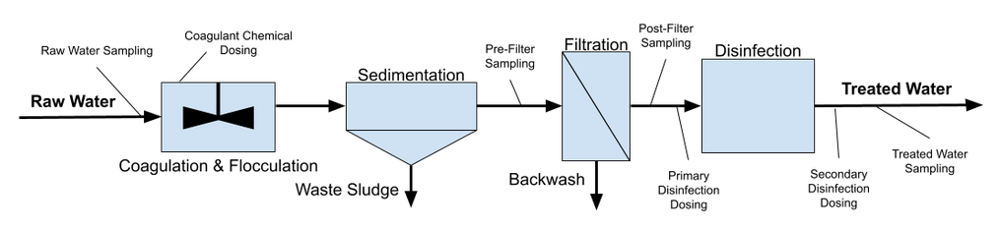
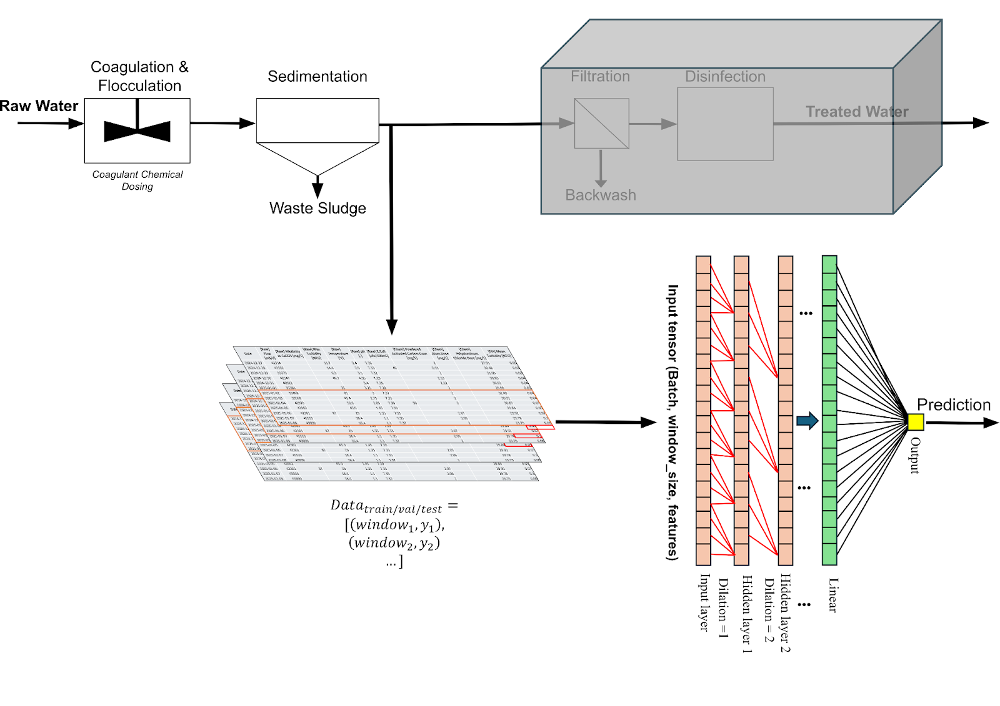

# *FluxForecast*: Water Treatment Plant Digital Twin for Turbidity Prediction (CHE1148 Course Project) 

This project details the initial stages of development of a digital twin for treated water turbidity prediction based on a machine learning model-backbone, using real water treatment plant data. Work is primarily centered around the implementation of a temporal convolutional network in comparison to baseline models. 

# **Process Schematic** 

# **Pipeline** 

# 📁 **Repository Structure**
---

* `data/` : Contains the raw dataset and metric evaluations.
* `src/` : Core library code.
    ** `PipelineCaller.py` to run the training loop.
* `Reports-Deliverables/` : Proposals, Interim & Final Reports, & Powerpoints